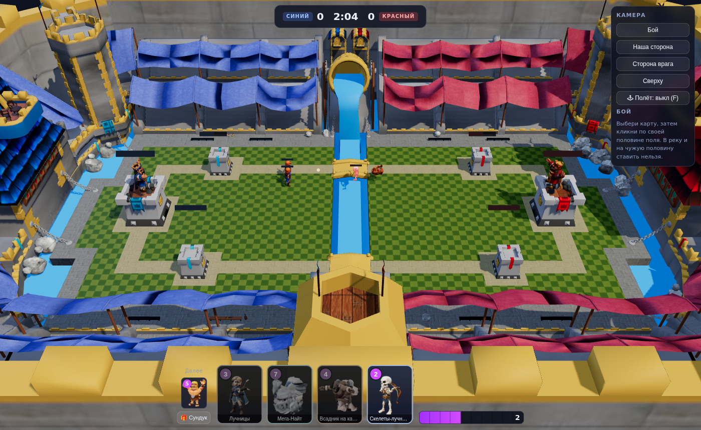
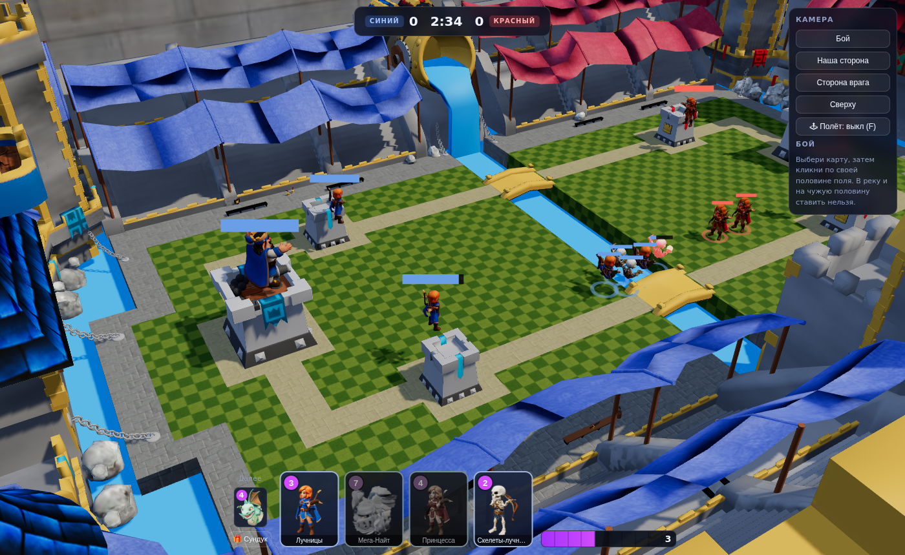
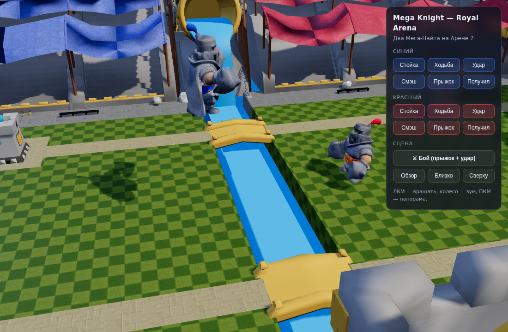
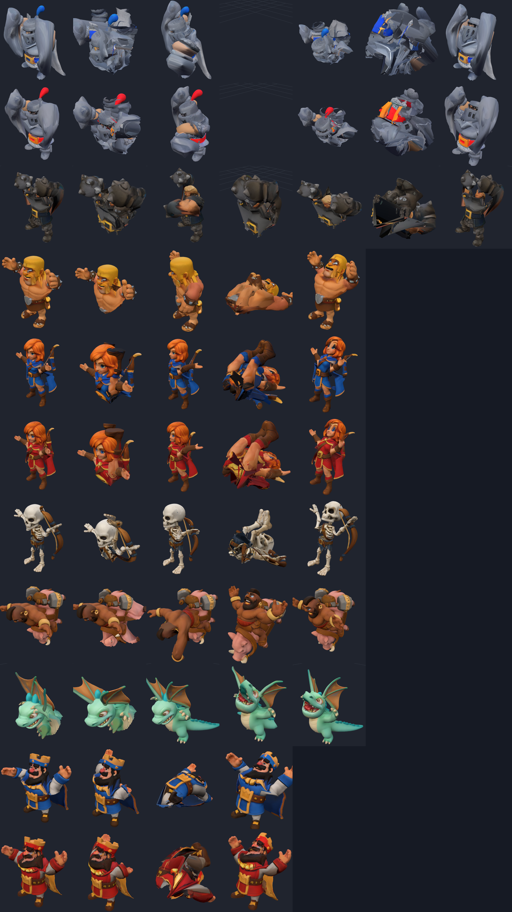

# Royal Clash — Clash Royale на своих моделях

Игра в браузере на локалхосте: арена из Clash Royale, все загруженные модели
превращены в игровые юниты с ригом и анимациями, бой против бота, эликсир,
карты, башни с прочностью и свободный полёт камерой по карте.

Модели пришли статичными сканами (OBJ без скелета, часть — на подставке),
поэтому весь риг, скиннинг и анимации генерируются кодом. В репозитории лежит
и пайплайн, и готовые GLB.

## Запуск

Ничего ставить не надо — хватит Python, который уже есть.

1. Скачать репозиторий: зелёная кнопка **Code → Download ZIP** на GitHub,
   распаковать. Или, если есть git:
   `git clone https://github.com/bonifirmaarm-design/studious-octo-broccoli`
2. Открыть терминал (Windows: Win+R → `cmd`) **в папке репозитория**.
3. Запустить сервер:

```bash
python -m http.server 8000
```

   (если ругается на `python`, попробовать `python3 -m http.server 8000`)

4. Открыть в браузере: **<http://localhost:8000/web/play.html>**

Сервер должен остаться запущенным, пока играешь. Остановить — Ctrl+C.

Просто открыть `play.html` двойным кликом **не получится**: браузер
запрещает модулям и моделям грузиться с `file://`, поэтому и нужен сервер.

Ещё по адресу <http://localhost:8000/web/> лежит отдельная сцена с двумя
Мега-Найтами и кнопками анимаций — удобно просто посмотреть на модели.

Всё нужное лежит в репозитории (three.js в `web/vendor/`), интернет не нужен.

### Как играть

1. Ждём, пока накопится эликсир (полоса справа внизу).
2. Кликаем по карте в руке — она подсветится.
3. Кликаем по своей половине поля. Круг зелёный — можно ставить, красный —
   нельзя (река или чужая половина).
4. Юниты сами идут к вражеским башням через мосты и дерутся.
5. Цель — снести башни. Победа по коронам за 3 минуты или сразу по
   разрушенной королевской башне.

Королевская башня спит, пока цела: она просыпается и начинает стрелять,
только если по ней попали или если пала одна из башен принцесс — как в
оригинале. Разрушенная башня исчезает с поля, остаются обломки.

## Что в игре

| | |
|---|---|
| **Карты** | Мега-Найт (7), Всадник на кабане (4), Варвары ×3 (5), Лучницы ×2 (3), Принцесса (4), Скелеты-лучники ×3 (2), Дракончик (4) |
| **Из сундука** | Мега-Найт Трамп — 10 эликсира, только через кнопку «Сундук», один раз за бой |
| **Башни** | 2 принцессы + королевская у каждой стороны, HP-полосы над ними, король просыпается после потери башни или попадания |
| **Гарнизон** | король сидит в королевской башне, лучница — в каждой башне принцессы; стреляют и падают вместе с башней |
| **Эликсир** | 1 за 2.8 с, максимум 10, двойной после 2:00 |
| **Матч** | 3 минуты. Ровно по коронам — доп. время 2 минуты, там побеждает первая снесённая башня, а если никто не снёс — решает остаток прочности башен |
| **×2 эликсир** | с отметки 2:00 (последняя минута) и до самого конца, включая доп. время |
| **Бот** | защищает атакованную линию дешёвыми картами, копит эликсир и идёт в контратаку |

Особенности юнитов: Мега-Найт приземляется с уроном по площади и **прыгает на
группу врагов** как в оригинале, Трамп — то же самое, но бьёт и по воздуху;
Всадник на кабане идёт только по башням; Дракончик летает и не тонет;
Принцесса бьёт с 10 метров по площади.

## Управление

* Выбрать карту → клик по своей половине поля. В реку и на чужую половину
  ставить нельзя, подсветка круга показывает, можно или нет.
* **F** — свободный полёт: **WASD** лететь, **Space/Shift** вверх-вниз,
  **R** ускорение, **ПКМ** осмотреться, колесо — скорость. Камера ограничена
  границами арены, улететь за карту нельзя.
* Кнопки камеры: бой, своя сторона, сторона врага, вид сверху.

## Что сделано с исходниками

* **Подставки убраны.** Плита ищется автоматически: это те горизонтальные
  срезы, где вершин в разы больше, а радиус по XZ вдвое шире самого персонажа.
  Была у Мега-Найтов, Трампа, варвара и красного короля.
* **Воздушные шары с карты убраны.** Два шара над полем состоят из четырёх
  мешей — оболочка, сетка, стропы, корзина; исключаются при конвертации
  USDZ → GLB.
* **Все модели анимированы.** Скелет строится по замерам силуэта каждой
  модели, скиннинг автоматический, клипы — общие для типа тела.
* **Вода — преграда.** Река проходима только по двум мостам; наземные юниты
  строят маршрут через ближний мост, летающие идут напрямую.
* **Карточки** — рендеры самих моделей на прозрачном фоне, а не рисунки.

## Роли моделей

| архив | юнит | тип рига | подставка |
|---|---|---|---|
| `34b7438e…` | Мега-Найт (синий) | mega | была |
| `615a648e…` | Мега-Найт (красный) | mega | была |
| `9f357f87…` | Мега-Найт Трамп | mega | была |
| `292893b0…` | Варвар | biped | была |
| `9e82ac55…` | Лучница | biped | — |
| `e092ce7c…` | Принцесса | biped | — |
| `1c638de5…` | Скелет-лучник | biped | — |
| `af37ae7e…` | Всадник на кабане | rider | — |
| `c5bc0717…` | Дракончик | dragon | — |
| `e4574fac…` | Король (синий) | biped | — |
| `f433705e…` | Король (красный) | biped | была |

## Анимации

Общие для двуногих: `Idle`, `Walk`, `Attack` (ближний бой), `Shoot`
(стрельба из лука), `Hit`, `Die`. У Мега-Найтов дополнительно `Jump`
(присед → взлёт → поджатые колени → приземление кулаками вниз) и `Smash`
(удар двумя кулаками сверху). Дракон машет крыльями и дышит огнём, кабан
скачет галопом, всадник бьёт молотом.

## Пайплайн

```bash
unzip '*.zip' -d assets_raw          # исходники, в git не хранятся
python3 tools/build_unit.py          # все юниты -> web/assets/units/*.glb
python3 tools/build_arena.py -o web/assets/arena.glb
python3 tools/card_art.py            # картинки карт
```

Зависимости: `numpy`, `pillow`, `usd-core` (чтение USDZ), `playwright`
(только для рендер-проверок).

### Модули пайплайна

| Файл | Задача |
|------|--------|
| `tools/glb.py` | писатель glTF 2.0 / GLB: текстуры, скины, анимации |
| `tools/objmesh.py` | чтение OBJ, сварка вершин, связные компоненты, удаление геометрии |
| `tools/anatomy.py` | поиск и срез подставки, нормализация |
| `tools/measure.py` | замеры силуэта: где руки, где расходятся ноги, где шея |
| `tools/archetypes.py` | раскладки скелета: двуногий, дракон, всадник |
| `tools/rig2.py` | ориентированные кости и скиннинг |
| `tools/anim2.py` | клипы анимаций |
| `tools/build_unit.py` | OBJ → риггнутый GLB, по таблице `tools/roster.py` |
| `tools/usd_read.py`, `tools/build_arena.py` | USDZ → GLB, удаление шаров |
| `tools/card_art.py` | рендер карточек на прозрачном фоне |
| `tools/render.py`, `tools/pose_sheet.py`, `tools/contact_sheet.py` | проверочные рендеры |
| `tools/playtest.py` | запуск игры в headless-браузере, прогон боя, скриншот |

### Модули игры

`web/game/config.js` — геометрия арены, карты, характеристики ·
`nav.js` — маршруты через мосты и расталкивание ·
`battle.js` — симуляция без графики · `ai.js` — бот ·
`view.js` — three.js, модели, HP-полосы, снаряды · `camera.js` — камеры и полёт ·
`ui.js` — HUD · `main.js` — сборка.

### Как устроен скиннинг

У сканов нет ни костей, ни разделения на части. Каждая вершина сначала целиком
привязывается к ближайшей кости (по расстоянию до отрезка кости), затем
половина вершин каждой кости, ближайшая к ней, «прибивается», а остальные веса
сглаживаются диффузией по рёбрам меша. Без такой фиксации свободная диффузия
сходится к равномерным весам, и тогда каждая кость тянет за собой всё тело.

### Соглашение о поворотах

Каждая кость смотрит вдоль своей локальной оси **+Y**, поэтому одни и те же
числа означают одно и то же движение на любой модели:

* **+X** — мах вперёд (в сторону взгляда),
* **+Y** — скрутка вдоль кости,
* **+Z** — мах вбок (зеркалится между `.L` и `.R`).

Поверх любого клипа накладывается «поза покоя»: модели сняты в T-позе, руки
опускаются на измеренный угол, поэтому клипы одинаково работают и на лучнице,
и на Мега-Найте.

## Скриншоты

| | |
|---|---|
|  |  |
| Общий вид матча | Король и лучницы в башнях, мосты, юниты |
|  |  |
| Мега-прыжок | Позы всех юнитов по клипам |

Арена до и после удаления шаров:
[с шарами](renders/arena_before_balloons.png) →
[без шаров](renders/arena_after_balloons.png).

## Чего нет

Это не полная копия Clash Royale: нет прогрессии, сундуков с таймерами,
коллекции, прокачки уровней, сетевой игры и матчмейкинга. Есть один бой против
бота на локальной машине.
