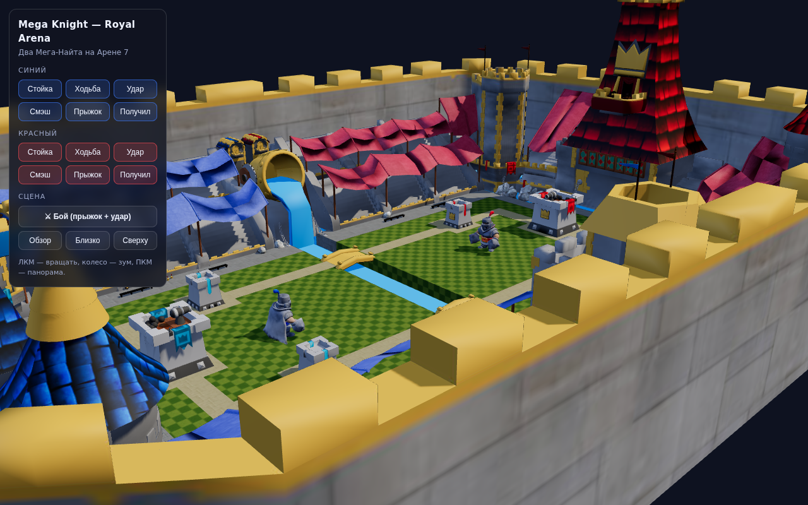
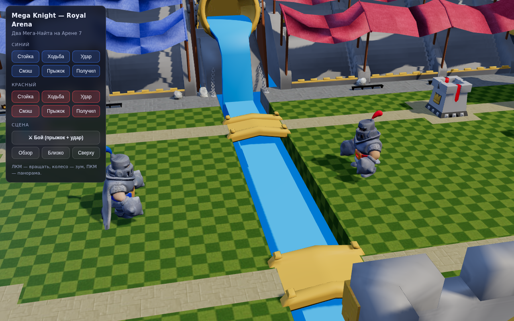
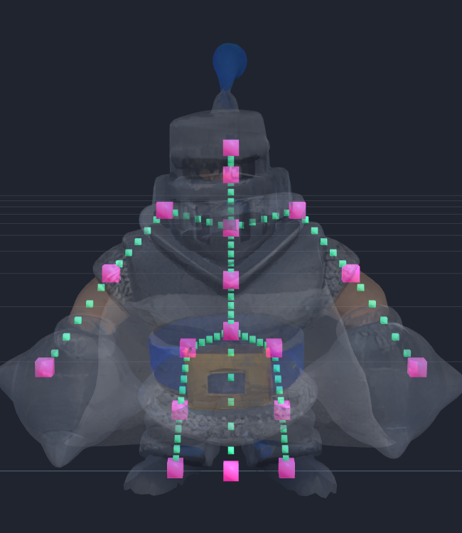

# Mega Knight — Royal Arena 3D

Два Мега-Найта из Clash Royale на Арене 7, в браузере, с анимациями.
Модели пришли как статичные сканы (OBJ без скелета), поэтому весь риг и все
анимации генерируются кодом — в репозитории лежит и пайплайн, и готовые GLB.

Что сделано с исходниками:

* **Подставка убрана.** Оба скана стояли на квадратной плите; она находится
  автоматически (плита — это пара горизонтальных срезов, где вершин в разы
  больше, а радиус по XZ вдвое больше самого персонажа) и срезается.
* **Воздушные шары с карты убраны.** Два шара над полем состоят из четырёх
  мешей — оболочка, сетка из верёвок, стропы и корзина; они исключаются при
  конвертации USDZ → GLB.
* **Рыцари анимированы.** Сгенерированный скелет на 18 костей, автоматический
  скиннинг и шесть клипов, включая удар и прыжок.

## Запуск

```bash
python3 -m http.server 8000
# затем открыть http://localhost:8000/web/
```

Всё, что нужно странице, лежит в репозитории (three.js в `web/vendor/`),
внешних CDN нет.

## Анимации

| Клип    | Длит. | Что происходит |
|---------|-------|----------------|
| `Idle`  | 2.2 с | дыхание, лёгкое покачивание (зациклен) |
| `Walk`  | 0.88 с| тяжёлый широкий шаг (зациклен) |
| `Punch` | 1.05 с| **удар**: замах со скруткой корпуса, выброс правого кулака вперёд на уровень груди, проводка |
| `Smash` | 1.15 с| удар двумя кулаками сверху вниз |
| `Jump`  | 1.95 с| **мега-прыжок**: присед, взлёт, поджатые колени в верхней точке, приземление кулаками вниз со сжатием и подъём |
| `Hit`   | 0.62 с| отбрасывание назад, когда прилетело |

В демо есть кнопка «Бой» — скриптовая связка: синий прыгает, приземляется,
бьёт, красный отлетает.

## Пайплайн

```bash
python3 tools/build_knight.py assets_raw/mk1 web/assets/knight_blue.glb
python3 tools/build_knight.py assets_raw/mk2 web/assets/knight_red.glb
python3 tools/build_arena.py  -o web/assets/arena.glb
```

`assets_raw/` — распакованные исходники (`unzip *.zip -d assets_raw/mkN`),
в git не хранятся, потому что восстанавливаются из архивов в корне репозитория.

Зависимости: `numpy`, `pillow`, `usd-core` (чтение USDZ), `playwright` — только
для рендер-проверок.

### Модули

| Файл | Задача |
|------|--------|
| `tools/glb.py` | минимальный писатель glTF 2.0 / GLB: текстуры, скины, анимации |
| `tools/objmesh.py` | чтение OBJ, сварка вершин, связные компоненты, удаление геометрии |
| `tools/anatomy.py` | поиск и срез подставки, нормализация, замеры пропорций |
| `tools/rig.py` | скелет и скиннинг |
| `tools/anim.py` | клипы анимаций |
| `tools/usd_read.py` | чтение мешей и материалов из USDZ |
| `tools/build_arena.py` | USDZ → GLB, список удаляемых мешей (шары) |
| `tools/build_knight.py` | OBJ → риггнутый GLB |
| `tools/render.py`, `tools/debug_rig.py`, `tools/shoot_scene.py` | оффскрин-рендер для проверки результата |

### Как устроен скиннинг

У сканов нет ни костей, ни разделения на части, поэтому веса считаются так:
каждая вершина сначала целиком привязывается к ближайшей кости (по расстоянию
до отрезка кости), затем половина вершин каждой кости, ближайшая к ней,
«прибивается» и остальные веса сглаживаются диффузией по рёбрам меша. Без
такой фиксации свободная диффузия сходится к равномерным весам, и тогда каждая
кость тянет за собой всё тело.

Отдельно запрещено кистям и ногам захватывать геометрию с другой стороны тела:
кулаки Мега-Найта висят так низко и широко, что по чистому расстоянию правый
кулак цепляет левое бедро.

### Соглашение о поворотах

Модель смотрит в `+Z`, вверх — `+Y`. Суффиксы `.L`/`.R` — стороны экрана при
взгляде спереди (`.R` = `+X`), а не анатомические стороны персонажа.

* кости, направленные вверх (Spine, Chest, Neck, Head): `+X` — наклон вперёд;
* кости, направленные вниз (руки, ноги): `−X` — мах вперёд;
* руки: `−Z` поднимает левую, `+Z` — правую.

## Скриншоты

| | |
|---|---|
|  |  |
| Общий вид арены (шары убраны) | Оба Мега-Найта на поле |
|  |  |
| Синий в верхней точке мега-прыжка | Сгенерированный скелет (рентген) |

Раскадровки клипов: [прыжок](renders/jump_sheet.png), [удар](renders/punch_sheet.png).
До/после по картинке: [с шарами](renders/arena_before_balloons.png) →
[без шаров](renders/arena_after_balloons.png).
До/после по модели: [с подставкой](renders/knight_before_pedestal.png).
