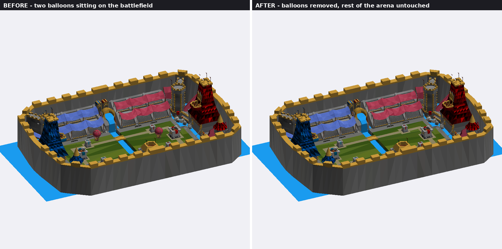
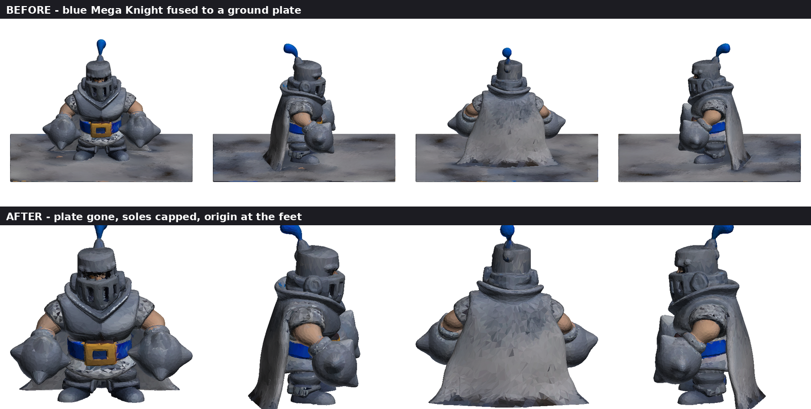
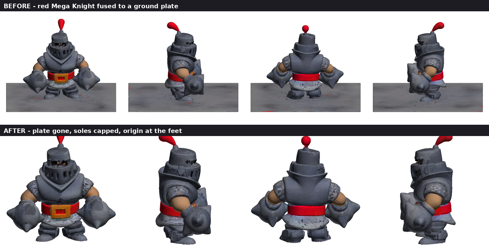

# Assets

Game-ready versions of the raw models in the repository root. Nothing here is
hand-edited — every file is produced by the scripts in [`tools/`](../tools), so
re-running them on a new model gives the same result.

## Arena

`arena/arena_royal_no_balloons.usdz` — the Royal Arena with the two hot-air
balloons that hovered over the battlefield removed. They were four whole meshes
(envelope, basket, ropes, rope anchors) and nothing else, so the prims are simply
gone and the remaining 88 meshes are byte-identical to the source. 455,535 tris.

`arena/arena_royal_no_balloons.glb` — the same scene as glTF, for engines that
don't read USD.

Y-up, 1 unit = 1 cm (`metersPerUnit = 0.01`). The playing field is roughly
3400 × 1250 units.

## Units

`units/mega_knight_blue/`, `units/mega_knight_red/`

| file | what it is |
|---|---|
| `model.obj` + `model.mtl` | mesh with UVs, for a DCC tool |
| `model.glb` | same mesh with the albedo embedded, for the engine |
| `albedo.jpg` | 4096² base colour |
| `orm.jpg` | 2048² packed map: R = AO, G = roughness, B = metallic |

Both are cleaned the same way:

- the ground plate the generator welded to the feet is cut off;
- the holes that opens under the soles (and under the blue knight's cape hem)
  are capped, so the mesh stays closed;
- the origin sits between the feet at ground level, X/Z centred — drop it at
  `y = 0` and it stands on the floor.

| | tris | height (units) | footprint |
|---|---|---|---|
| blue | 21,496 | 1.289 | 1.293 × 0.795 |
| red | 20,880 | 1.409 | 1.397 × 0.711 |

Scale is normalized per model by the generator, so the two knights are not the
same height in absolute terms. Pick one height as the reference and scale the
rest of the roster to it when importing.

### Before rigging

The mesh is a single closed surface with no skeleton — it needs bones and weights
before it can be animated. The topology is generator output (uniform triangles,
no edge loops at the joints), so expect to either retopologize the arms and legs
or lean on an automatic weighting pass and clean up the shoulders and hips.

## Regenerating

```sh
pip install numpy trimesh pillow usd-core

python3 tools/clean_pedestal.py <model.zip> assets/units/<name> <name>
python3 tools/clean_arena.py <arena.usdz> assets/arena/<name>.usdz
python3 tools/arena_to_glb.py assets/arena/<name>.usdz assets/arena/<name>.glb
```

`clean_pedestal.py` finds the plate on its own — it looks for the highest thin
slice near the bottom of the mesh that still spans the model's whole X/Z
footprint — so it should handle the rest of the cards without tuning. If a model
comes out with a leftover rim or with its feet clipped, pass an explicit cut
height to `clean()` instead.

## Previews




